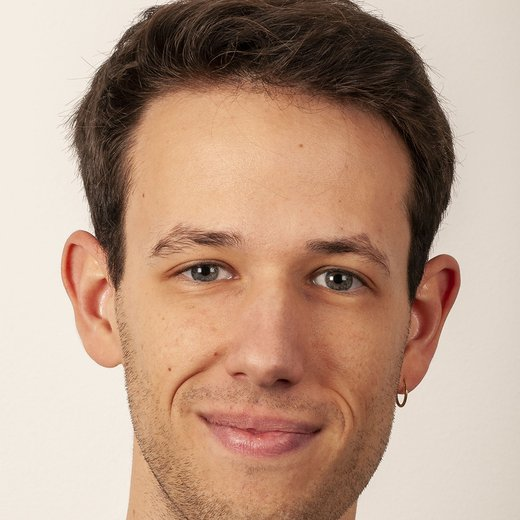

<!--
  THIS PAGE IS BUILT FROM SEVERAL FILES
  - This file: the header (above), About, and CV & contact.
  - _includes/publications.md      → journal articles and book chapters
  - _includes/outreach.md          → public outreach
  - _includes/projects.md          → research projects
  - _includes/work-in-progress.md  → work in progress
  Each "## " heading below becomes its own tab in the menu.
-->

## About

{: .about-photo}

I am a sociologist working on health, social inequality, genetics and the welfare state. I am a postdoctoral fellow at the Centre for Fertility and Health at the Norwegian Institute of Public Health, where I study mental health, education and the labour market.

Before that, I was a postdoctoral fellow at the Department of Sociology and Human Geography at the University of Oslo (2022–2025), working on genetics, intergenerational transmission and socioeconomic status. I did my PhD in sociology at KU Leuven (2018–2022) on public opinion towards distributive justice in the welfare state.

I am an Associate Editor of [*Social Justice Research*](https://link.springer.com/journal/11211).

## Publications



#### Public outreach



## Research projects



## Work in progress



## CV & contact

[Download my CV (PDF)](cv.pdf)

Email: [arno.van.hootegem@fhi.no](mailto:arno.van.hootegem@fhi.no)

Centre for Fertility and Health, Norwegian Institute of Public Health, Oslo, Norway
